# BoogieBox

BoogieBox is a self-hosted music library and player for Windows and Linux designed for collectors, audiophiles, and anyone with a large local music collection.

Enjoy lightning-fast browsing, powerful search, playlists, lyrics, visualizations, Auto DJ, and personalized multi-user experiences. BoogieBox helps you rediscover your library instead of letting it sit untouched on a drive.

Its standout feature, BoogieMix, is an experimental AI-powered DJ system that turns ordinary playlists into seamless mixes by analyzing tracks and planning smooth transitions between songs.

Also includes waveform and BPM analysis, mobile-friendly access, optional DLNA/UPnP streaming, and rich metadata and artwork enrichment.

---

## 📸 Screenshots

### Home

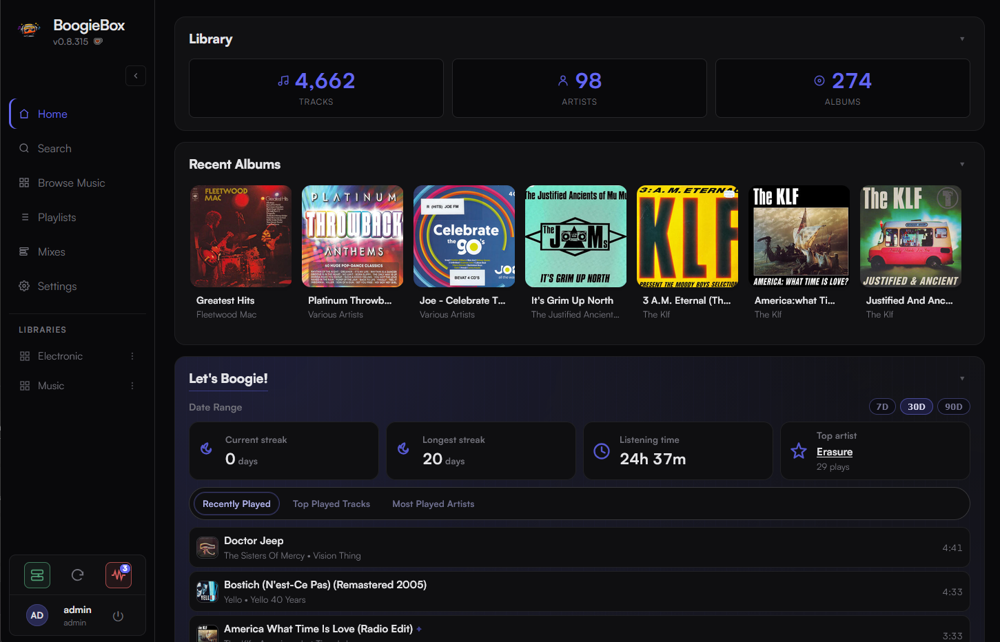

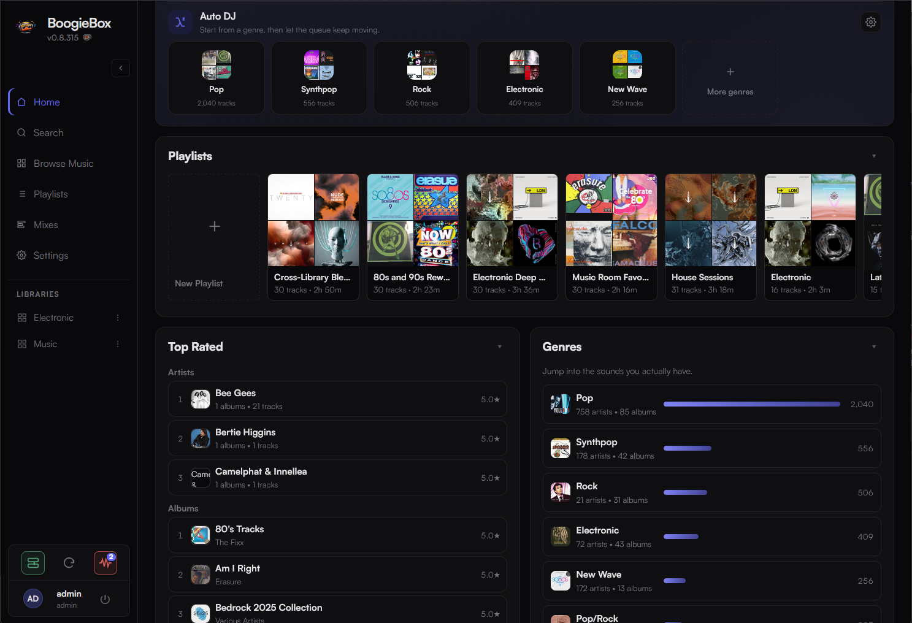

### Browse Albums

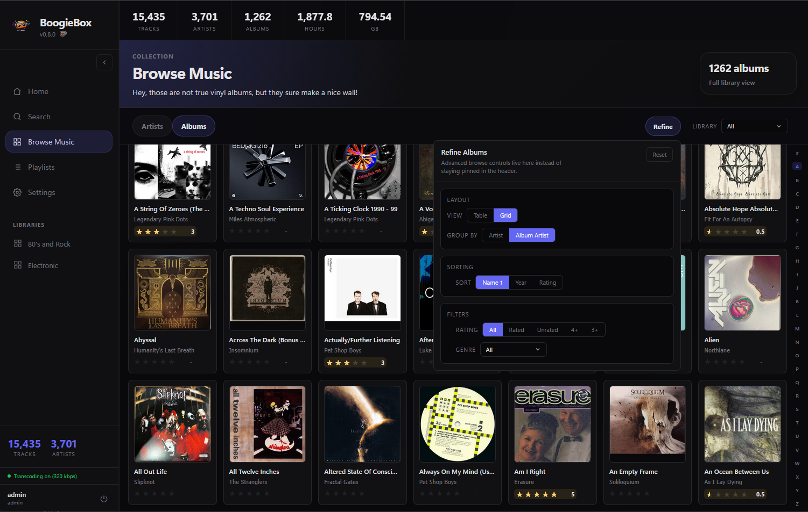

### Artist Page

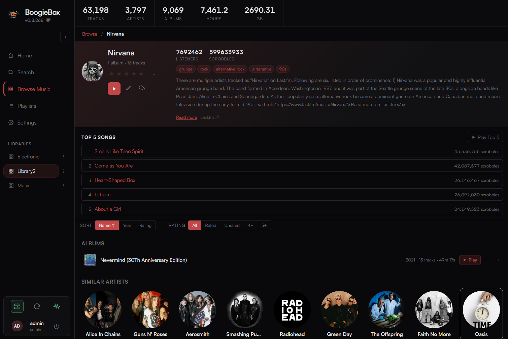

### Auto DJ

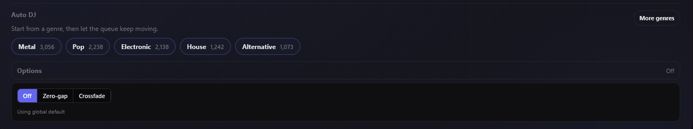

### BoogieMix

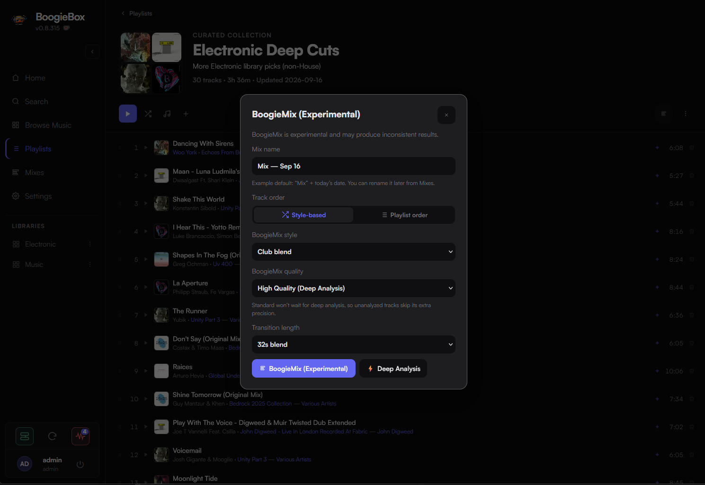

### Karaoke Playback

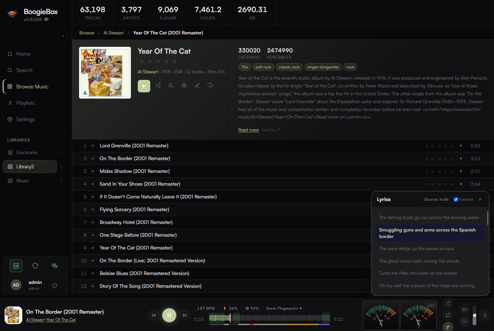

### Vinyl Mode

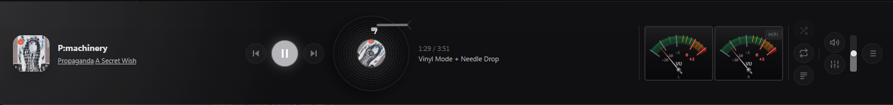

### Parametric EQ

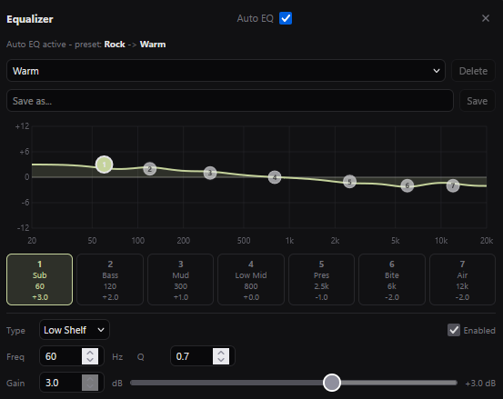

### Mobile Playback

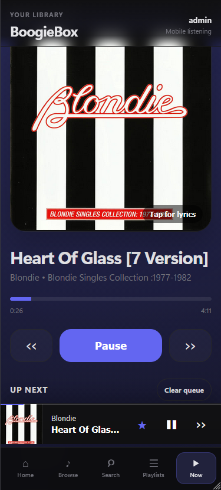

### Themes

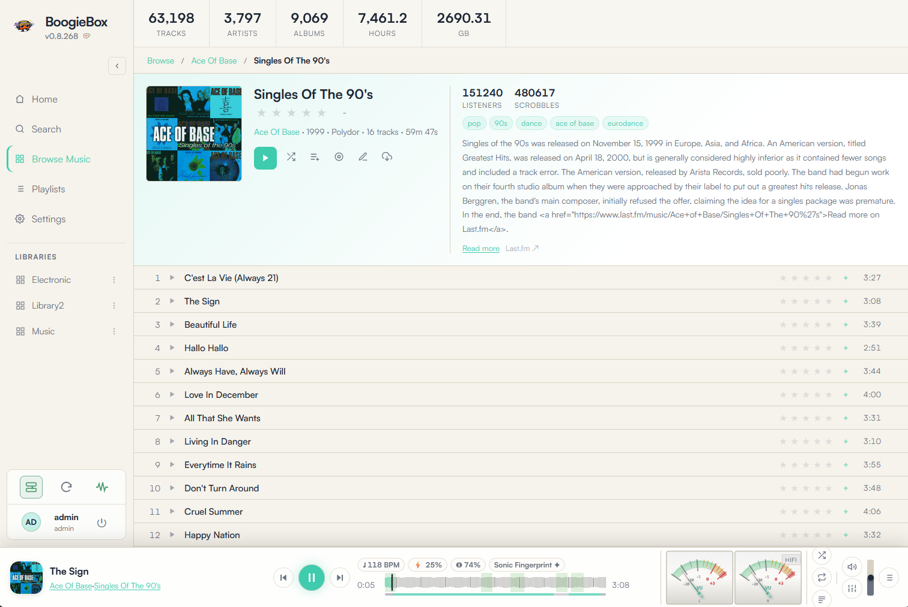

### Library Settings

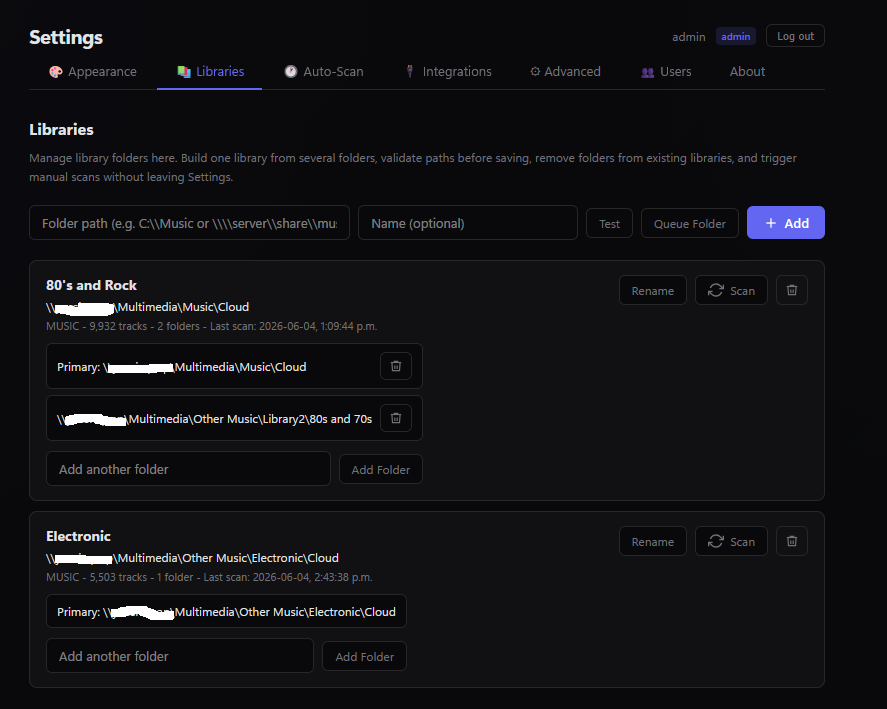

---

## Why BoogieBox?

- Built for people who own and curate their music collections
- Multi-user support with individual preferences and ratings
- AI-powered BoogieMix DJ engine
- Vinyl Mode plays your music with an analog look and sound (yeah, some crackles & pops)
- Karaoke lyrics and waveform navigation
- Genre Galaxy music discovery
- Mobile-friendly interface
- DLNA/UPnP streaming support
- Fully self-hosted with no subscriptions

---

## 🤖 Meet BoogieMix

BoogieMix is BoogieBox's experimental AI DJ.

Instead of simply shuffling tracks, BoogieMix analyzes your music and creates continuous listening sessions by intelligently planning transitions between songs.

Whether you're creating a workout mix, a party playlist, or a long background listening session, BoogieMix aims to make your playlists feel more like a professionally mixed DJ set.

### Features

- Intelligent transition planning
- AI-assisted mix generation
- Optional deep-analysis mode for advanced track matching
- Fully local processing
- Downloadable rendered mixes

---

## ✨ Highlights

### 🎵 Your Music, Your Way

- Organize and browse music across multiple folders and drives
- Fast search, playlists, favorites, and personalized listening history
- Individual user profiles with avatars, optional PIN protection, and personal preferences
- Rate artists, albums, and tracks with half-star precision

### 🤖 Experimental AI DJ Features

- BoogieMix automatically plans transitions between tracks
- AI-assisted mix generation for smoother playlist playback
- Optional deep-analysis mode for advanced track matching and transition planning
- Early-stage DJ capabilities that continue to evolve with each release

### 🎧 Rich Listening Experience

- Full-featured music player with queue management, shuffle, repeat, and smooth transitions
- Interactive waveform seek bar with Sonic Fingerprint stem-analysis overlay for precise navigation
- Sonic Fingerprint panel showing per-stem energy, vocal/drum/bass presence, and transition windows from deep analysis
- Synchronized lyrics and karaoke mode
- Vinyl Mode for a classic turntable-inspired experience
- 7-band parametric EQ with presets, custom profiles, and automatic artist-based EQ matching

### 🌌 Discover More Music

- Auto DJ keeps the music flowing based on your library and listening habits
- Genre Galaxy visualizes relationships between your favorite genres and artists
- Artist insights powered by Last.fm
- Personalized home screen featuring listening trends, statistics, and recommendations

### 📱 Mobile Friendly

- Lightweight mobile experience designed for quick browsing and playback
- Browse artists, albums, playlists, and search your library from your phone
- Dedicated Now Playing screen with full playback controls

### 🖼️ Artwork, Metadata & Library Enrichment

- Automatic artwork and metadata enhancement from multiple online sources
- Manual artwork management when you want complete control
- Background analysis for BPM, waveforms, and other music insights
- Extensive caching for fast browsing and responsive playback

### 🔗 Connect Your Music Ecosystem

- Last.fm scrobbling and artist information
- Lyrics integration
- DLNA/UPnP streaming for compatible devices
- Optional integrations for artwork, metadata enrichment, and advanced music analysis

### 🏠 Built for Self-Hosting

- Server can run on Windows or Linux
- Simple first-run setup
- Connect to free metadata providers
- Multi-user support
- Local and network library support
- Optional Windows desktop application with automatic server discovery (in dev)

---

## 📊 Feature Summary

| Feature | Supported |
|----------|----------|
| Multi-user Profiles | ✅ |
| Playlists | ✅ |
| Karaoke Lyrics | ✅ |
| Waveform Navigation | ✅ |
| Auto DJ | ✅ |
| BoogieMix AI Mixing (experimental!) | ✅ |
| Genre Galaxy | ✅ |
| Mobile Interface | ✅ |
| DLNA/UPnP Streaming | ✅ |
| Last.fm Integration | ✅ |
| Artwork Enrichment | ✅ |
| Sonic Fingerprint (stem analysis) | ✅ |
| Local Music Libraries | ✅ |

---

## 🎼 Supported Formats

**Music:** MP3, FLAC, M4A/MP4 Audio, OGG, OPUS, WAV, AAC, WMA, AIFF

---

## 🛠️ Built With

- Rust
- React
- TypeScript
- Tauri 2
- SQLite
- FFmpeg

---

## 🚀 Installation

### Windows

1. Download the latest release.
2. Run the installer.
3. Launch BoogieBox.
4. Follow the first-run setup wizard.
5. Start enjoying your music.

### Linux (server only)

BoogieBox runs on Linux as a headless server. Use any browser on the same network to access the UI.

#### From a release tarball (recommended)

1. Download the latest `boogiebox-*-linux-rs.tar.gz` from the [Releases](https://github.com/yossironnen/BoogieBox/releases) page.
2. Extract and install:

```bash
tar -xzf boogiebox-*-linux-rs.tar.gz
cd boogiebox-*-linux-rs
sudo ./install/install.sh
```

3. Open `http://localhost:3001` in a browser and complete the setup wizard.

#### From source

```bash
git clone https://github.com/yossironnen/BoogieBox
cd boogiebox
./build-server-rust.sh --no-test
sudo ./Releases/boogiebox-*/install/install.sh
```

#### Non-systemd / manual run

```bash
BOOGIEBOX_CONFIG_DIR=~/.config/boogiebox ./boogiebox-server
```

Then open `http://localhost:3001` in a browser to complete first-run setup.

### Developers

See the documentation below for development setup and build instructions.

---

## 🔒 Security Notice

BoogieBox is designed for local-network use.

It has not been hardened or tested for public internet exposure. Do not expose BoogieBox directly to the internet.

---

## 📚 Documentation

### User Documentation

- Installation Guide
- User Guide
- BoogieMix Guide

### Developer Documentation

- `Docs/Architecture.md`
- `Docs/API.md`
- `Docs/Development.md`
- `Docs/ProjectStructure.md`

---

## ❤️ Why I Built BoogieBox

Most modern music platforms focus on streaming. BoogieBox focuses on helping you enjoy and rediscover the music you already own.

Whether you're managing a carefully curated FLAC collection, building playlists for every mood, singing along with karaoke lyrics, or experimenting with AI-generated mixes through BoogieMix, BoogieBox is designed to make local music collections feel alive again.

---

## Support BoogieBox

BoogieBox is developed independently and offered free for self-hosting.

If you enjoy the project and would like to support its continued development, you can [support BoogieBox on Ko-fi](https://ko-fi.com/yronnen).
